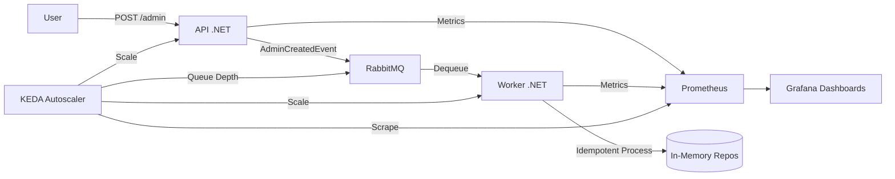

# ☸️ KubeKata: Kubernetes Architecture Mastery

Bienvenue sur le projet **KubeKata** ! Ce repository est un environnement d'apprentissage pratique (Kata) pour maîtriser l'architecture et l'opérabilité sur Kubernetes avec .NET.

> [!IMPORTANT]
> **Objectif Souveraineté** : Ce projet vise à démontrer comment maîtriser la **priorisation des conteneurs en environnement On-Premise**. L'enjeu est de garantir la **souveraineté de l'architecture informatique** en reprenant le contrôle total sur l'ordonnancement et la résilience de ses propres serveurs, sans dépendance aux abstractions propriétaires du Cloud.

---

## 🏗️ Architecture du Projet

Le projet simule une architecture moderne de production basée sur l'asynchronisme et l'observabilité :



### Composants Clés :
- **API (Producer)** : Point d'entrée, expose des métriques HTTP et produit des événements.
- **Worker (Consumer)** : Traite les messages de manière idempotente.
- **RabbitMQ** : Broker de messages isolé dans son propre namespace (`queue`).
- **Telemetry** : OpenTelemetry + Prometheus + Grafana pour une visibilité totale.
- **Autoscaling** : KEDA pilotant le scale-out basé sur la charge réelle.
- **Gouvernance** : Utilisation de `PriorityClass` et `ResourceQuota` pour la stabilité du cluster.

---

## 📂 Structure du Repository

| Dossier | Contenu |
| :--- | :--- |
| **`application/`** | Code source de l'API ASP.NET Core 10. |
| **`worker/`** | Code source du Background Service .NET 10. |
| **`k8s/`** | **Le Kata** : Manifestes YAML simplifiés pour l'apprentissage pas à pas. |
| **`k8s/final/`** | **La Cible** : Version finale statique avec toutes les configurations avancées. |
| **`helm/kubekata/`** | **L'Orchestration** : Chart Helm pour un déploiement complet. |
| **`scripts/`** | Utilitaires (test de charge, setup). |

---

## 🚀 Démarrage Rapide

### Prérequis
- `minikube` + `docker`
- `kubectl` + `helm`
- Consulter le fichier [PREREQUISITES.md](./PREREQUISITES.md).

### Installation Complète (via Helm)
```bash
# Déploiement de toute l'infrastructure
helm install kubekata ./helm/kubekata

# Vérification
kubectl get pods -A
```

### Le Tutorial (Pas à pas)
Pour apprendre à construire cette architecture de zéro, suis le guide :
👉 **[GUIDE STEP-BY-STEP (MAC)](./stepbystep_mac.md)**

---

## 📊 Observabilité & Monitoring

- **Prometheus** : [http://localhost:9090](http://localhost:9090) (via port-forward)
- **Grafana** : [http://localhost:3000](http://localhost:3000) (User: `admin`, MDP: à récupérer via secret)
- **Métriques custom** : `kubekata_admins_created_total`, `kubekata_worker_processed_total`.

Pour plus de détails sur le flux de télémétrie, voir [COMPRENDRE_TELEMETRIE.md](./COMPRENDRE_TELEMETRIE.md).
